<div align="center">
  
</div>

<br>

```text
LAYER 01 ─ identity
────────────────────────────────────────
name      adi
role      backend engineer
location  japan
lang      ru · en · ja
```

```text
LAYER 02 ─ tools
────────────────────────────────────────
daily     go · python · php · fastapi · postgres · redis · docker · aws
learning  laravel · graphql · nuxt · real-time audio
```

```text
LAYER 03 ─ experiments
────────────────────────────────────────
[ running ]  voice agents      low-latency STT → LLM → TTS
[ running ]  go concurrency    channels, backpressure, shutdown
[ parked  ]  scrapers          fast, polite, event-driven
[ parked  ]  tiny services     one job, one binary
[ done    ]  paiza rank A · jlpt n2
```

<div align="center">
  <sub>omnipresent in the wired</sub>
</div>
